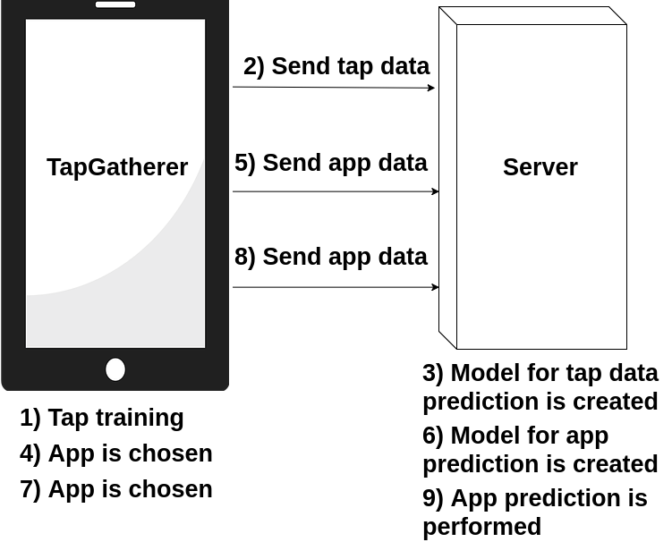

# running-app-detection

Master's Thesis Project. [Master in Cibersecyrity | UC3M](https://www.uc3m.es/ss/Satellite/Postgrado/en/Detalle/Estudio_C/1371209197821/1371219633369/Master_in_Cybersecurity)

## Advisors
* LORENA GONZALEZ MANZANO
* JOSE MARIA DE FUENTES

## Abstract

With each upgrade of the Android OS, it has been clear that user’s privacy is a key feature. One of the measures taken with this in mind has been the gradual elimination of features that allowed to know which application was being executed at any given time. In this paper, it is shown how an application with minimal permissions can still obtain this information. In order to achieve application prediction, a series of approaches are proposed to obtain data, extract features, train models and predict which application is a user running at a given time. In order to do so, a client-server architecture is used, where the smartphone is responsible of motion events gathering and the extraction of motion-related features; whilst the server predicts touch events and which app is being used by a certain user. Finally, a small set of countermeasures are proposed in order to avoid this kind of attacks.

## Training and prediction flow

